# 系统使用说明书
**易梦军 161240085**

（南京大学 匡亚明学院 161240085@smail.nju.edu.cn）

**提醒**：如果本文档有图片丢失或者格式不兼容等问题，可以访问我的github：[https://github.com/ymj1327/CG_ymj](https://github.com/ymj1327/CG_ymj) 查看。

## 1. 开发环境及代码编译说明
### 1.1 开发环境
| 程序名称 | CG_ymj  |
| --- | --- |
| 操作系统 | macOS Mojave 10.14.4  |
| 开发软件 | Qt Creator 4.8.2  |
| 编译环境 | QT 5.12.2(Clang 10.0(Apple),64 bit) |
| 开发语言 | C++  |

### 1.2 代码编译

    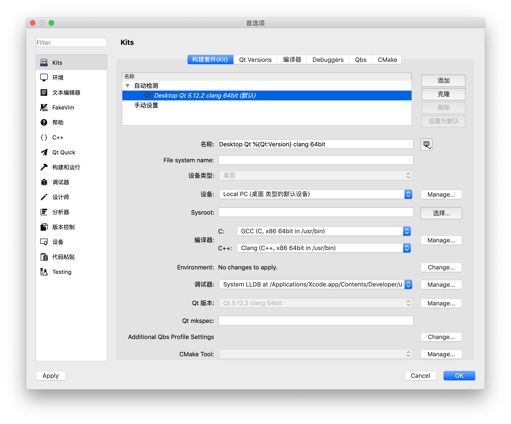

## 2. 目录结构及程序运行说明
### 2.1 目录结构

- source  
  	- CG_ymj.pro
	- SOURCES += main.cpp mainwindow.cpp draw.cpp 
	- HEADERS += mainwindow.h draw.h
	- FORMS += mainwindow.ui draw.ui
	- RC_ICONS = drawCG.ico
	- RESOURCES += myicon.qrc
	- myicon
- binary
	- CG_ymj(Mac)
	- CG_ymj(Windows)
- picture
	- report_data
	- test_input.txt
	- output_1.bmp
	- output_2.bmp
	- ...
- 161240085_系统说明书.md
- 161240085_6月报告.pdf 

### 2.2 程序运行
	方法一： 在对应的系统下直接双击提供的可执行文件运行
	方法二： 按照上面的环境配置，在QT中编译后运行

## 3. 程序使用及结果展示
### 3.1 命令行界面CLI
#### 3.1.1 相关说明
命令行界面程序接受两个参数：

（1）指令序列文件（每行一条指令）

（2）图像保存目录（**注意**：要将指定序列文件放在该目录下）

**特别提醒**：<u>为了防止还需要输入指令序列文件所在目录，所以我直接共用了路径，即图像保存目录就是指令序列文件所在目录，指定序列文件在图像保存目录下才能正常保存。</u>

#### 3.1.2 具体步骤
	1，运行程序
	2，上面文本框中输入命令后回车："filename filepath"
	例如：input.txt /Users/ymj/Desktop/（Windows下需要加盘符）
	3，下面文本框中显示"save as xxx.bmp"表示运行成功
	4，若失败请检查命令输入是否正确，若始终不成功请联系我
	

    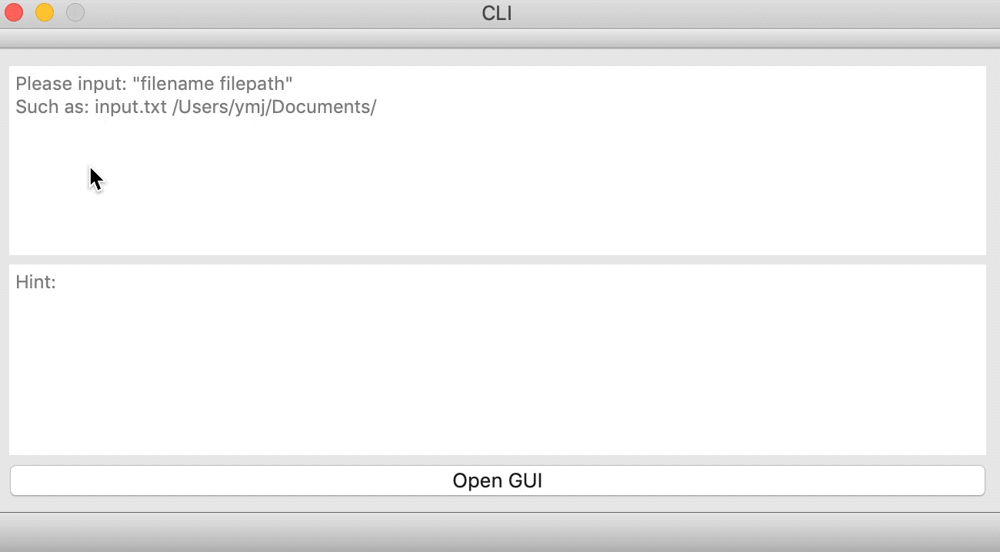

### 3.2 图形用户界面GUI
**注意**：若不特别说明，点按按钮均是以鼠标**左键**点按。
#### 3.2.1 打开GUI界面
点击最下面的按钮**Open GUI**，即可打开图形用户界面。

    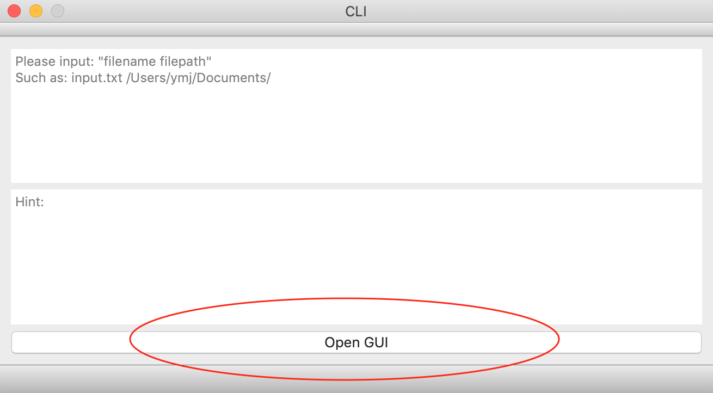

#### 3.2.2 重置画布
（1）按左侧**Clear**按键可以清空当前画布。

（2）直接拖动窗口来设置宽高。

    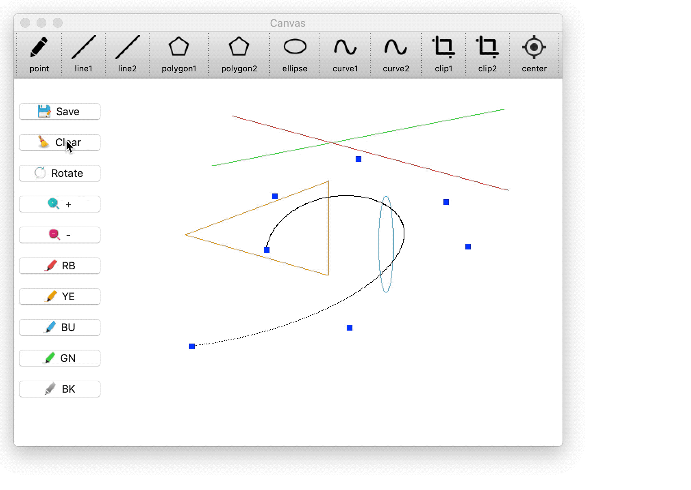

#### 3.2.3 保存画布
按左侧**Save**按键可以保存当前画布。

**提醒**：仅保存图元，不会保存用以辅助操作的控制点、中心点以及裁剪窗口等。

    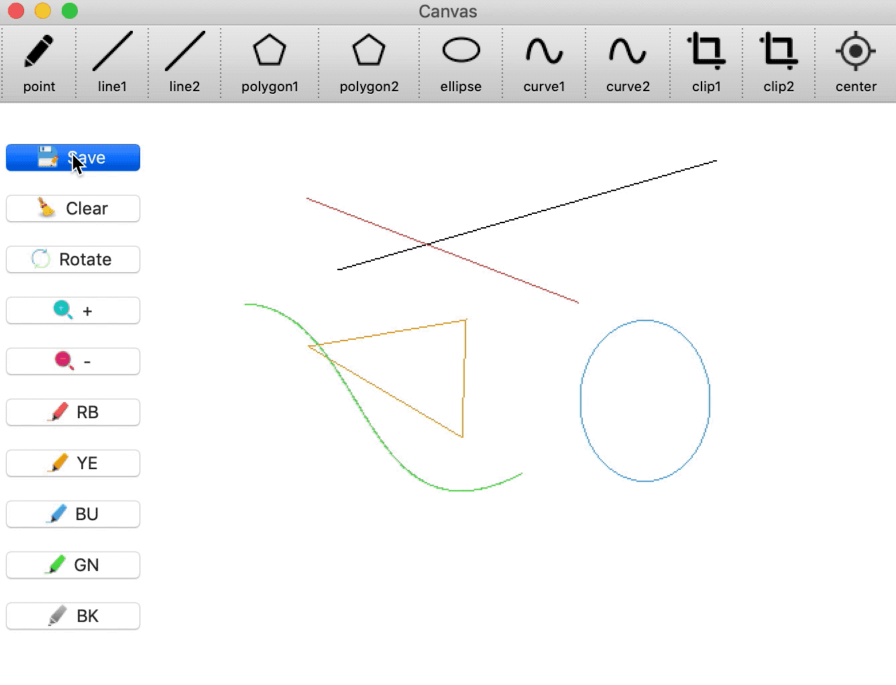

#### 3.2.4 设置画布颜色
按左侧五个按钮**RB、YE、BU、GN、BK**可以切换颜色。

    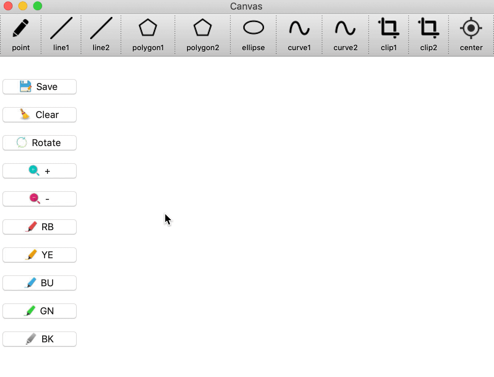

#### 3.2.5 绘制线段
（1）按**line1**按钮（以**DDA算法**绘制线段），然后在画布上**先后点按两个点（不是拖移）**即可绘制两点之间的线段。

（2）按**line2**按钮（以**Bresenham算法**绘制线段），然后在画布上**先后点按两个点**即可绘制两点之间的线段。

**注意**：<u>每次点击**画线**按钮后，仅能绘制一条线段，若要继续绘制相同图元，再次点击该按钮后，即可继续绘制下一条线段。</u>

    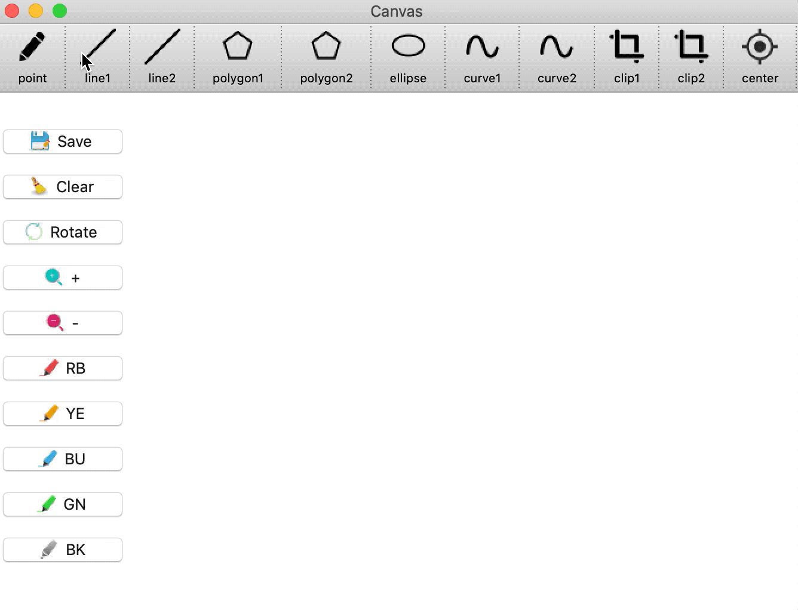

#### 3.2.6 绘制多边形
（1）按**polygon1**按钮（以**DDA算法**绘制多边形），然后在画布上先后点按多个点，在最后一个点，<u>点击鼠标**右键自动补全**</u>。

（2）按**polygon2**按钮（以**Bresenham算法**绘制多边形），然后在画布上先后点按多个点，在最后一个点，<u>点击鼠标**右键自动补全**</u>。

**注意**：每次点击**画多边形**按钮后，仅能绘制一个多边形，若要继续绘制相同图元，再次点击该按钮后，即可继续绘制下一个多边形。

    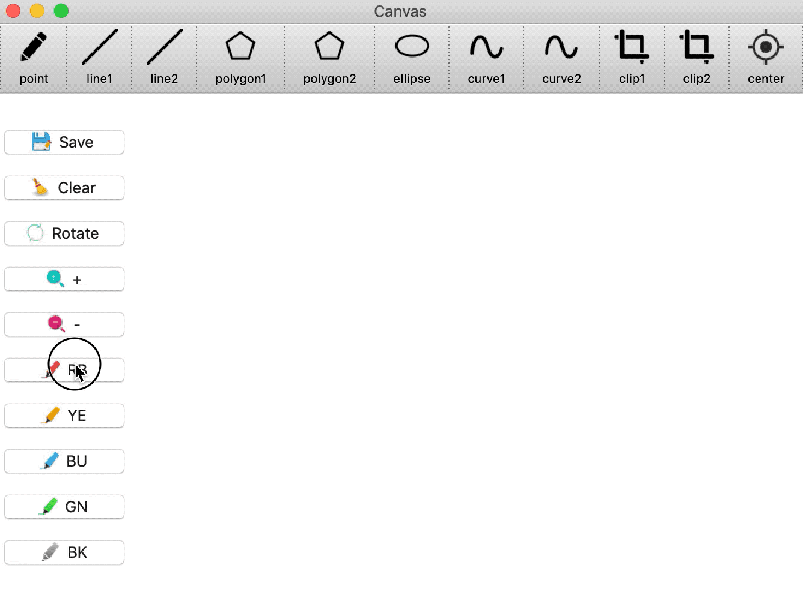

#### 3.2.7 绘制椭圆
按**ellipse**按钮（以**中点椭圆算法**绘制椭圆），然后在画布上**先后点按**两个点即可绘制两点对角之间的椭圆。

**注意**：每次点击**画椭圆**按钮后，仅能绘制一个椭圆，若要继续绘制相同图元，再次点击该按钮后，即可继续绘制下一个椭圆。

    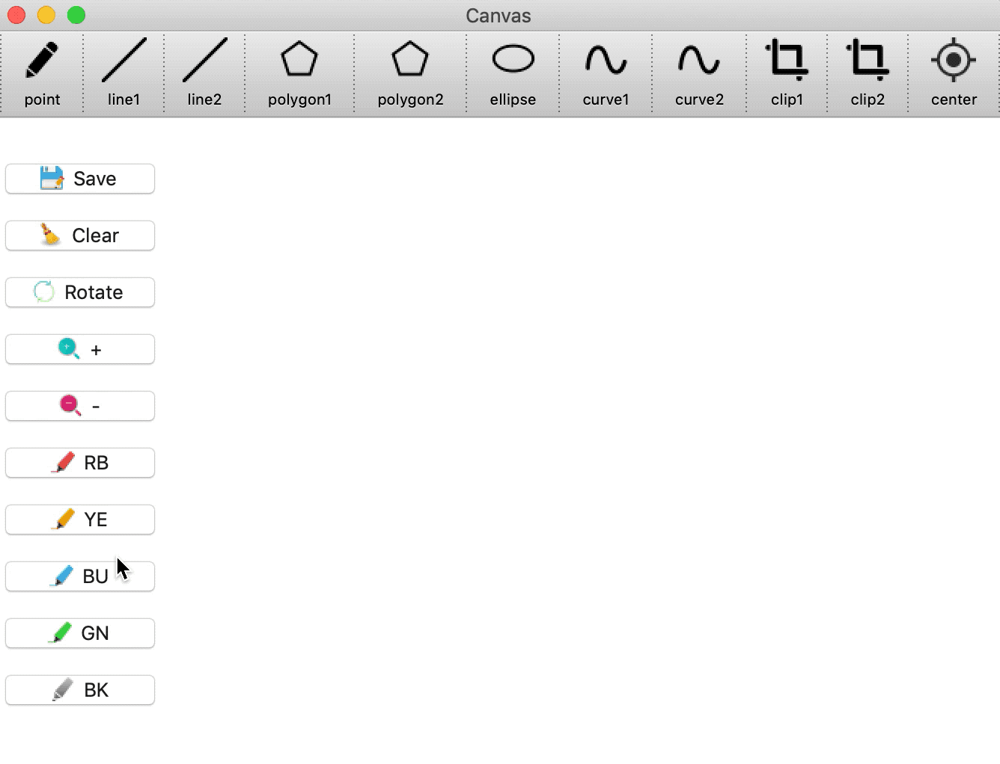

#### 3.2.8 绘制曲线
（1）按**curve1**按钮（以**Bezier算法**绘制曲线），然后在画布上先后点按多个点，就可生成一条Bezier曲线。

（2）按**curve2**按钮（以**B-spline算法**绘制曲线），然后在画布上先后点按多个点，就可生成一条3阶B-spline曲线。

**注意**：每次点击**画曲线**按钮后，仅能绘制一条曲线，若要继续绘制相同图元，再次点击该按钮后，即可继续绘制下一条曲线。

    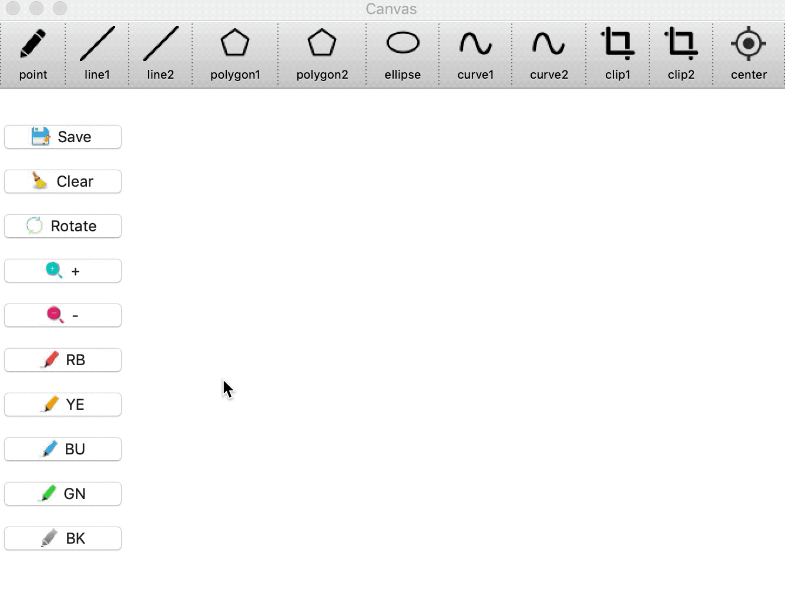

#### 3.2.9 平移
按**键盘**上面的**上下左右键**，即可对**当前图元**进行平移。

**注意**：仅可对当前有控制点的图元进行平移。

    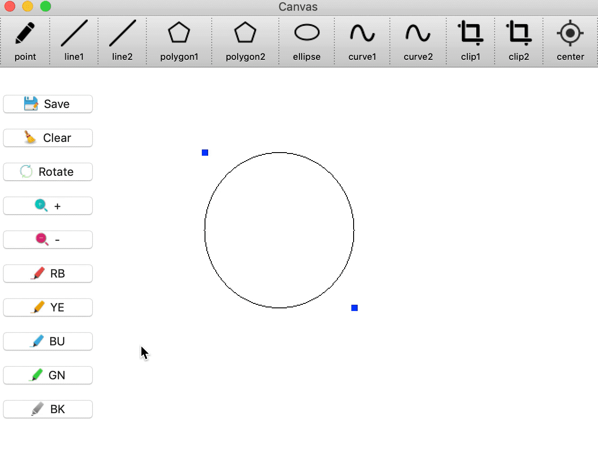

#### 3.2.10 旋转
（1）按**center**按钮，在画布上任意位置点按，得到旋转中心。

（2）按左侧**Rotate**按钮，即可绕旋转中心顺时针旋转。

**注意**：仅可对当前有控制点的图元进行旋转。

    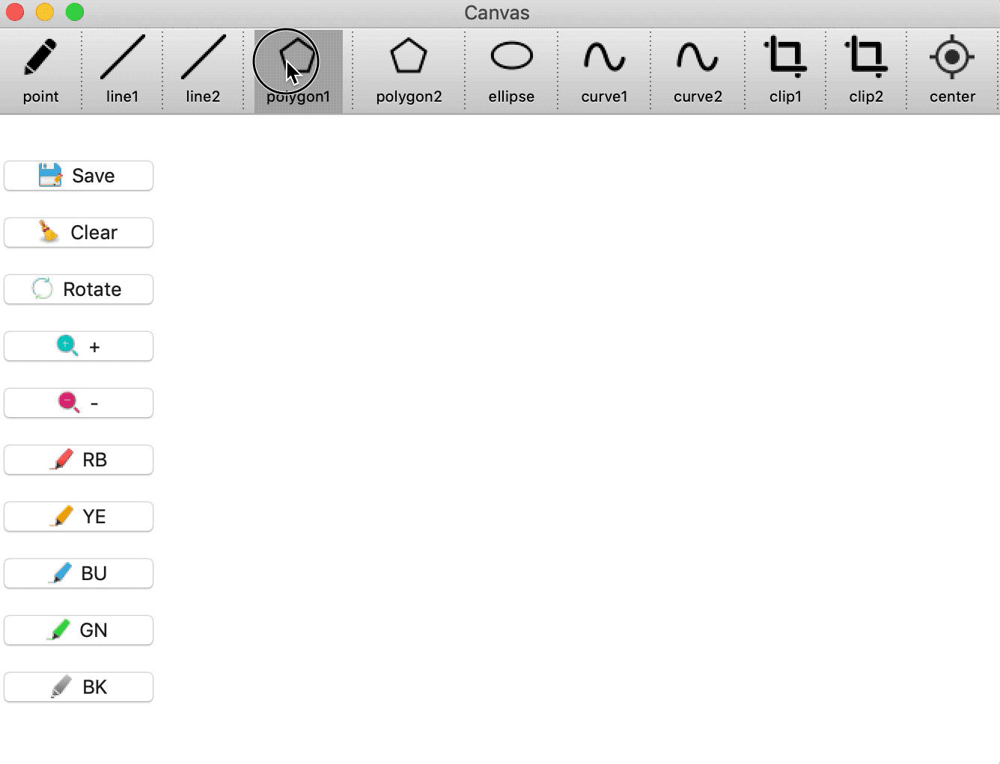

#### 3.2.11 缩放
（1）按**center**按钮，在画布上任意位置点按，得到缩放中心。

（2）按左侧**"+"**或者**"-"**按钮，即可绕缩放中心放大或者缩小。

**注意**：仅可对当前有控制点的图元进行缩放。

    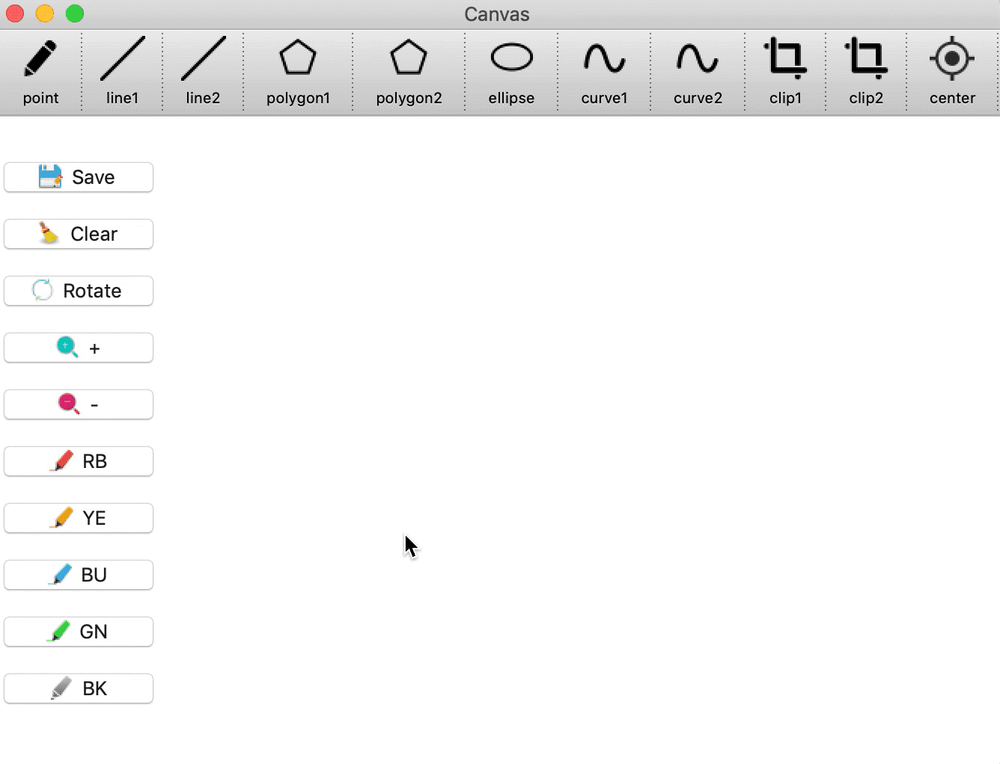

#### 3.2.11 裁剪
（1）画一条直线，按**clip1**按钮，在画布上先后点按两个点，得到裁剪窗口，从而以**Cohen-Sutherland算法**对该直线进行裁剪。

（2）画一条直线，按**clip2**按钮，在画布上先后点按两个点，得到裁剪窗口，从而以**Liang-Barsky算法**对该直线进行裁剪。

**注意**：裁剪只能对线段进行裁剪。

    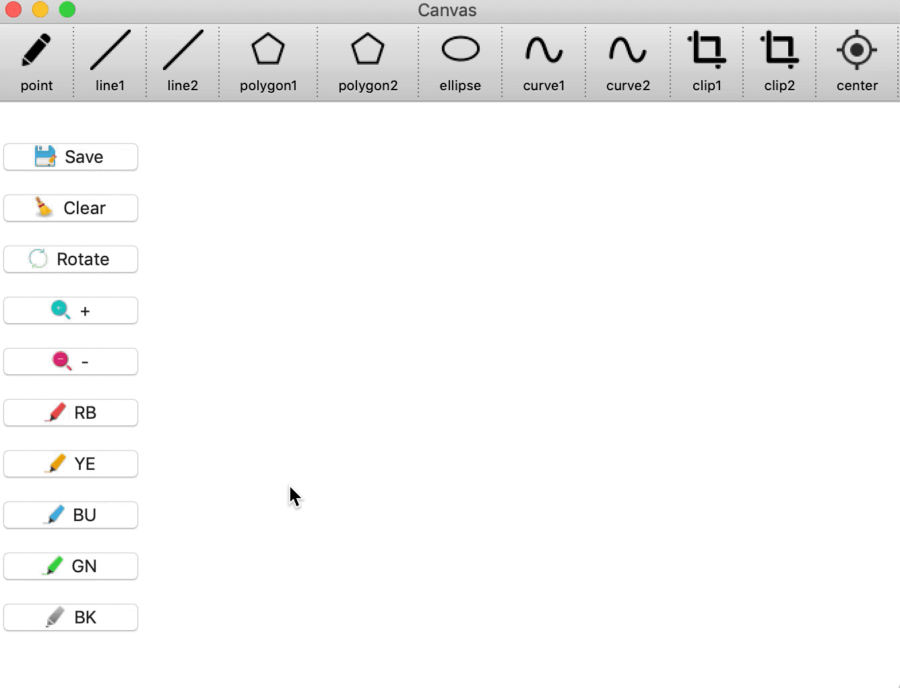

